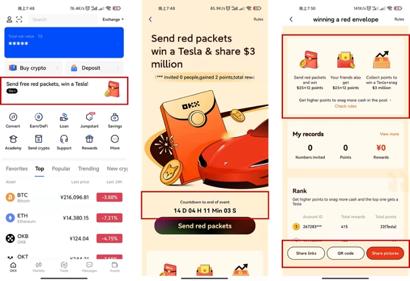
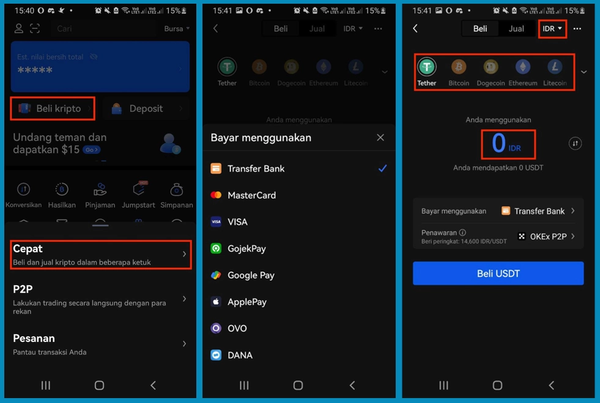
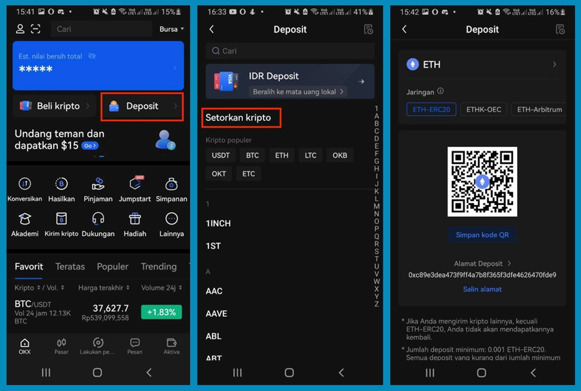
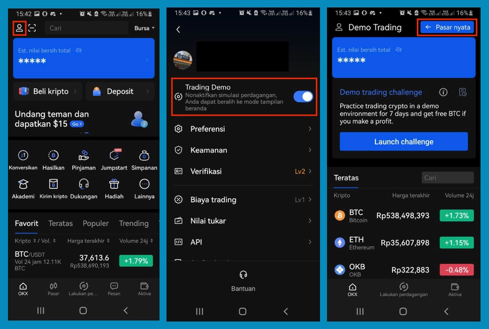
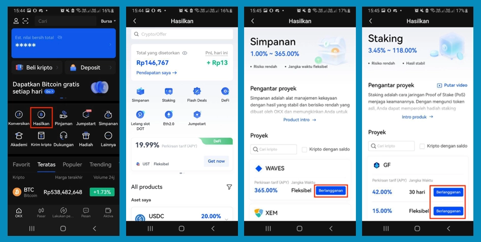
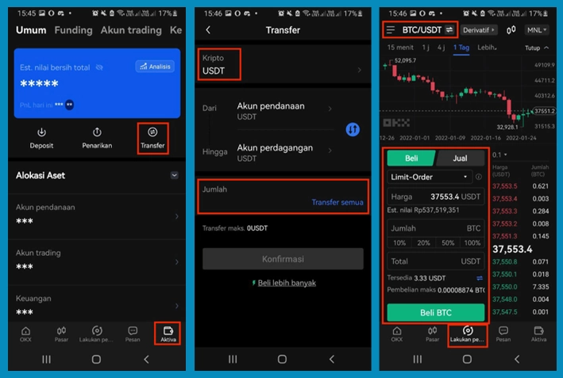
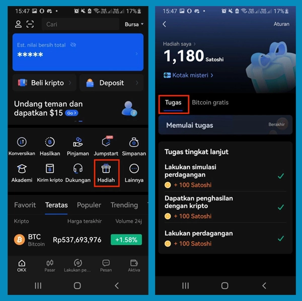
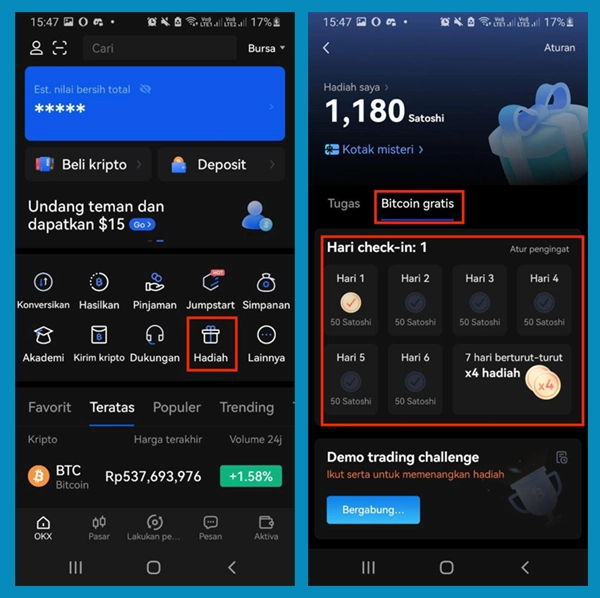

# Get Free Bitcoin Rewards from OKX Up to 200 USDT

Looking for a straightforward way to earn cryptocurrency without complicated steps? OKX's latest reward program lets new users grab up to 200 USDT just by completing simple tasks—buying crypto, sending virtual red packets, or trying demo trading. Whether you're brand new to crypto or just looking for an easy bonus, this guide breaks down each reward opportunity and shows you exactly how to claim them.

---

So here's the deal. OKX decided to celebrate their rebranding and the Lunar New Year by basically throwing money at new users. Not literally, but close enough—up to 200 USDT if you play your cards right.

The whole thing works through a referral program where you pick tasks based on what you're comfortable doing. Some are super basic, some require a bit more involvement. Let's walk through what's actually on the table.

## Your Reward Options (Pick What Works for You)

### Option #1: The Red Packet Thing

This one's pretty fun, honestly. You send free "Angpau" (virtual red packets) to friends, and boom—both of you get $25 USD plus 12 points. The more points you rack up, the better your odds of winning a Tesla. Yeah, a Tesla.

**How to send these packets:**

First, update your OKX app. Then tap "send Angpau" on the home screen. You'll see a countdown showing when this whole thing ends, plus the rules laid out pretty clearly.

You've got three ways to share:

1. Copy and send the invitation link directly
2. Show your friend a QR code they can scan on the spot
3. Grab one of the preset poster designs and blast it across social media

That last option's actually smart if you've got a decent following somewhere.

### Option #2: The Starter Tasks

New users have 30 days after signing up to either buy or deposit crypto. Do that successfully and you're looking at up to $10 in BTC or rebates.

One catch: the exact reward varies depending on your payment method. Check the [official details](https://www.okx.com/support/hc/en-us/articles/360059321352) if you want the breakdown.

**Buying crypto is dead simple:**

Log into your OKX account and hit "Buy crypto." Choose "Quick" mode. Pick which cryptocurrency you want and which fiat currency you're paying with. Type in the amount. Select your payment method. Done.

Once payment clears, the crypto lands in your OKX account. If you want more buying options, [they've got a whole guide](https://www.okx.com/academy/en/start-trading-cryptocurrency-on-okex/).

**Depositing crypto you already own:**

Maybe you've already got some digital currency sitting in another wallet. Just move it over to OKX to qualify.

Hit "Deposit" on the home page. Pick the token you're transferring—let's say ETH. OKX generates a deposit address for you. You'll see minimum amount requirements and some warnings about making sure everything's correct.

Send your crypto to that address from your other wallet. When it arrives, you're good to start trading.

### Option #3: Advanced Tasks (For the Slightly More Ambitious)

Want to squeeze out up to 300 satoshi? Try these:

- Run some demo trades
- Subscribe to an Earn product
- Execute any amount of real crypto trading

**Demo trading is basically practice mode:**

Tap your profile icon (top left). Find "Trading Demo" and launch it. You're now in a risk-free sandbox where you can experiment without losing actual money.

When you want to switch back to real trading, just hit "Real market" on the page.

**Subscribing to Earn products:**

Click "Earn" from the home screen. Browse through savings or staking projects. When something catches your eye, hit "Subscribe."

**Actually trading crypto:**

You'll need to move funds from your funding account to your trading account first. Go to "Assets" and click "Transfer." Pick your token, decide how much to move over.

Then head to the Trade page. Choose your market (like BTC/USDT). Select your order type. Fill in price and quantity. Submit.

When the market fills your order, congrats—you just traded. If you need more guidance, check their [FAQ section](https://www.okx.com/support/hc/en-us/categories/115000275231-FAQ).

**Claiming your rewards from starter and advanced tasks:**

Once you've finished any of these tasks, click the "Rewards" button on the home page to grab your earnings.

### Option #4: The Daily Grind (Smaller But Consistent)

Check in every day and do some demo trading? You can pull in up to 1,500 satoshi per week. Plus you get shots at mystery boxes that could contain up to $100.

👉 [Start earning free crypto rewards today—new users get up to 200 USDT just for trying out OKX](https://www.okx.com/join/47044926)

**Here's how daily rewards work:**
  
Hit "Rewards," then "Free Bitcoin." Just by visiting this page daily, you collect satoshi automatically.

Scroll down on that same page and you'll find "Demo trading challenge" if you want to stack more rewards through practice trades.

**What to do with your free Bitcoin:**

You've got two choices. One: withdraw satoshi to your funding account (minimum 10,000 satoshi required). Two: spend 1,000 satoshi to open a mystery box with potential prizes up to $100 USD.

There's no limit on mystery boxes. Open as many as you want. Your winnings show up under "My Rewards."

---

## Why This Actually Works

OKX isn't just throwing around rewards for fun. They're making it ridiculously easy for newcomers to understand crypto trading without the usual confusion and intimidation. The demo trading option alone removes the biggest barrier—fear of losing money while learning.

The structure's pretty clever too. Complete simple tasks, earn real rewards, and gradually work your way up to more advanced features as you get comfortable. No pressure to dive into complex trading strategies before you're ready.

👉 [Join OKX now and claim your welcome rewards—up to 200 USDT waiting for new users](https://www.okx.com/join/47044926)

Whether you're completely new to cryptocurrency or just hunting for some bonus funds, OKX's reward program gives you multiple paths to earn. Pick the tasks that match your comfort level, follow the straightforward steps, and watch the rewards stack up.
